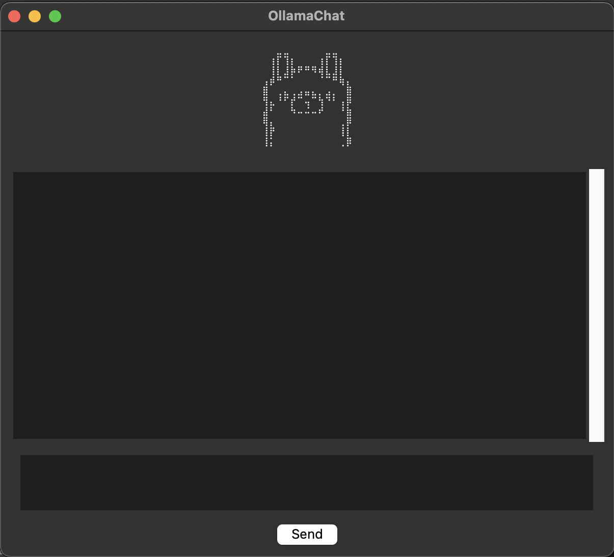

# Hi! 
Welcome to my OllamaChat demo on building a little Ollama-powered chatbox on your computer!

A lightweight Python GUI chat app using tkinter that connects to a local Ollama instance.

Sending prompts to a local Ollama model (e.g., Lamma3), and saving .json files (Path: home/ollama_vault) and display responses.

It works accross-platforms: macOS and Windows!

Simply:
1. Download or Clone this repo and Ollama
2. Compile app (Windows or MacOS)
3. Execute: ollama_gui

Prerequisites:
- Python 3.8+
- Ollama installed and running (Download: https://ollama.com/)
- Model needs to be pulled locally (e.g., $ ollama run llama3)
- pyinstaller
- tkinter
- requests
- datetime 
- json
- os

Terminal Commands:
## MacOS/Linux:
$ pyinstaller --windowed --onefile ollama_gui.py

## WindowsOS:
$ pyinstaller --windowed --onefile ollama_gui.py

Click on the ollama_gui executable to run! (Path: dist/ollama_gui)

Happy prompting!

If you have questions regarding open-source ML, feel free to contact me!

🥷🏼👾 douzog(@)proton.me